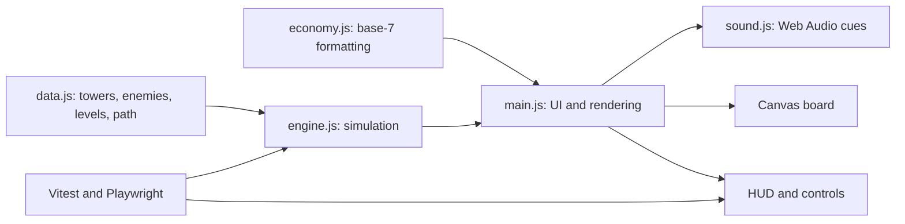

# System Architecture Reference

Runehold TD is a small Vite application with a deterministic simulation core and a canvas/DOM presentation layer. The system is intentionally simple: game rules should be easy to test, while visuals and sound can stay expressive.

## Runtime Overview

## Data Flow

1. `data.js` defines static content: grid size, base path, build pads, enemies, levels, and tower branch upgrade data.
2. `main.js` creates a `GameEngine`, renders controls, and forwards player actions.
3. `engine.js` mutates simulation state in response to placement, branch upgrades, sell, start-wave, and tick events.
4. `engine.js` emits short event objects such as `place`, `shoot`, `defeat`, `escape`, `sell`, and `waveClear`.
5. `engine.js` summarizes upcoming waves for the player-facing preview.
6. `main.js` converts engine events into floating text, particles, shake, high-score updates, and sound triggers.
7. `economy.js` formats all visible currency using the three denominations of 7.
8. Tests inspect the engine directly for deterministic rules and use Playwright for browser-facing behavior.

## State Boundaries

### Keep In `engine.js`

* Money, lives, waves, wave index, spawn timers, enemies, towers, projectiles, events.
* Tower placement, branching upgrades, sell/refund logic, target selection, damage, rewards, speed scaling, endless wave generation, win/loss state.
* Any future rule that should be independently testable.

### Keep In `main.js`

* DOM markup and control rendering.
* Canvas drawing, hover state, selected tower state, range previews, endpoint labels.
* Floating text, particles, camera shake, high-score persistence, sound dispatch.
* Browser-only concerns such as `localStorage`, `AudioContext`, canvas sizing, and event listeners.

### Keep In `data.js`

* Static numeric balance values.
* Enemy/tower display names, colors, stats, costs, rewards, and branching upgrades.
* Enemy trait metadata and trait assignments.
* Level definitions and, in future, per-level paths/build pads.

## Data-Configuration

**File**: `work/src/data.js`

Defines the game board and static balance:

* `CELL`: canvas cell size in internal pixels.
* `GRID`: board dimensions.
* `PATH`: current route as grid coordinates.
* `BUILDABLE`: legal tower pads.
* `ENEMIES`: five enemy profiles.
* `LEVELS`: three authored levels, starting money, lives, and waves.
* `TOWERS`: four tower profiles with two or three branching upgrade tiers each.

When changing this file, update or add tests for count requirements, legal cells, and balance-sensitive values.

## Economy-Formatting

**File**: `work/src/economy.js`

Owns base-7 currency helpers:

* `toDenominations(amount)`
* `formatMoney(amount)`
* `canAfford(balance, cost)`

All player-facing prices and balances should use `formatMoney`. Do not hand-format currency in UI code.

## Engine-Simulation

**File**: `work/src/engine.js`

Contains deterministic gameplay rules:

* Level loading and reset.
* Tower placement, branching upgrade choices, and sell/refund.
* Wave start and enemy spawning.
* Enemy motion along the path.
* Tower target selection and projectile bookkeeping.
* Damage, armor pierce, shield breaker, slow resistance bypass, hunter's marks, executions, shatter damage, multishot, splash damage, chain lightning, defeat rewards, elite escapes, lives, win/loss.
* Speed scaling through `speedMultiplier`.
* Endless mode continuation after authored waves.
* Next-wave summaries through `previewWave()` and `summarizeWave()`.
* Event emission for presentation.

Important public fields used by UI/tests:

* `money`
* `lives`
* `waveIndex`
* `towers`
* `enemies`
* `projectiles`
* `events`
* `status`
* `message`
* `speedMultiplier`
* `endlessMode`

Upgrade helpers:

* `getUpgradeOptions(indexOrTower)`: returns the available choices for a tower's next tier.
* `upgradeTower(index, choiceIndex = 0)`: applies one mutually exclusive choice from the next tier.
* `applyUpgradeStats(stats, upgrade)`: merges additive, max-valued, and boolean counterplay properties.

Prefer adding pure helpers when simulation rules become complicated. Keep UI state out of the engine.

## Audio-System

**File**: `work/src/sound.js`

Implements a small `SoundSystem` around the Web Audio API:

* Creates `AudioContext` only after user interaction.
* Toggles sound through explicit player control.
* Plays short synthesized cues keyed by engine event names.
* Throttles rapid shot sounds so combat remains audible without becoming a wall of noise.

Audio should remain optional. Gameplay must be fully understandable without sound.

## Visual-Styling

**File**: `work/src/styles.css`

Defines layout and fantasy RTS presentation:

* Google Font imports.
* Compact top HUD.
* Board-first responsive layout.
* Side panel controls.
* Wood, stone, parchment, gold, and mana-inspired panel styling.
* Speed controls, demolish button, enemy ledger, inspection panel.

The board should remain the dominant viewport element. Avoid adding large explanatory text or marketing-style sections to the game screen.

## Main-Logic

**File**: `work/src/main.js`

Coordinates the browser experience:

* Writes the app shell markup.
* Renders levels, towers, branching upgrade choices, next-wave preview, inspection, HUD, and enemy ledger.
* Handles clicks, canvas hover, tower placement, upgrade choices, sell, speed, reset, sound, and endless toggle.
* Draws cells, path, endpoints, towers, enemies, projectiles, range previews, particles, and floating text.
* Saves per-level high scores in `localStorage`.
* Exposes `window.__game` for test inspection.

This file is currently the largest file. If it grows further, consider extracting rendering helpers or UI rendering into separate modules with new `SYSTEM.md` sections.

## HTML-Entrypoint

**File**: `work/index.html`

Minimal Vite entrypoint:

* Provides `

`.
* Loads `src/main.js`.
* Contains the reference header required by `AGENT.md`.

## Build-And-Tooling

**Files**: `work/package.json`, `work/vitest.config.js`, `work/playwright.config.js`

Primary scripts:

* `npm run dev`: Vite dev server, usually with `-- --port 4174`.
* `npm run build`: production build into `outputs/game`.
* `npm run test`: Vitest unit tests.
* `npm run test:e2e`: Playwright browser scenarios.
* `npm run test:all`: unit tests, build, then E2E tests.

The Playwright config starts the dev server automatically for browser tests.

## Unit-Testing

**Files**: `work/tests/data.test.js`, `work/tests/economy.test.js`, `work/tests/engine.test.js`, `work/tests/simulation.test.js`

Unit tests protect:

* Required counts: 3 levels, 5 enemies, 4 towers, 2-3 upgrade tiers per tower, and two choices per tier.
* Currency denominations and affordability.
* Legal path/build-pad detection.
* Tower placement, branching upgrade, trait-counter stat merging, and sell/refund rules.
* Wave progression, enemy defeat rewards, loss state, and speed scaling.
* Deterministic balance simulations for viable strategies and targeted counters.

Add unit tests when changing simulation rules, currency, level data, or tower/enemy balance contracts.

## E2E-Testing

**File**: `work/e2e/game.spec.js`

Browser scenarios protect player workflows:

* Initial content loads.
* Tower placement and branching upgrades.
* Starting and resolving a wave.
* Level switching and reset values.
* Invalid placement feedback.
* Demolish/sell flow and refund display.
* Speed and pause controls.

Use `data-testid` for stable selectors. Keep tests focused on visible behavior and avoid brittle canvas pixel assertions unless verifying a specific rendering regression.

## Outputs

**Directory**: `outputs/`

Generated user-facing deliverables:

* `outputs/game/`: production build.
* `outputs/concrete-panic-td-screenshot.png`: latest visual screenshot.

Do not treat `outputs/` as source. Rebuild from `work/` when source changes.
